# Research Paper
* Name: Benjamin Northrop
* Semester: Spring 2024
* Topic: AVL Trees
* Link The Repository: [github link](https://github.com/Sp24-CS5008-Online-Lionelle/final-reseach-paper-bnjnrthrp.git)

Note the following is an example outline to help you. Please rework as you need.

## Introduction

This paper discusses AVL trees, invented in 1962 and named after its inventors - G.M. Adelson-Velsky and E.M. Landis[^1]. It solves the problem of binary search trees becoming easily becoming unbalanced, and its poor performance in dealing with sorted or nearly-sorted data. In its average case, Binary Search Trees will find an object in $O(h)$ time, where h is the height of the tree (distance from the root to the furthest leaf)[^2]. In its worst case, though, a binary tree could have a height of $n$ if you were to insert data that was sorted in ascending or descending order. For example, inserting the data set {1, 2, 3, 4, 5} into a BST would end up looking like the attached image.

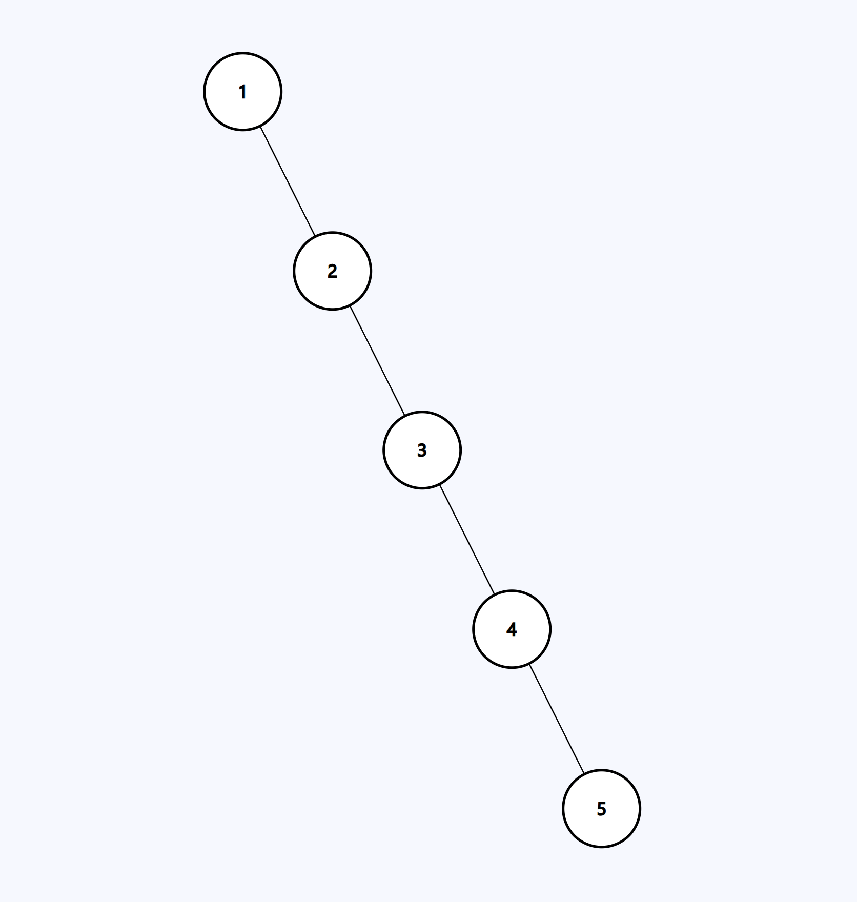

This ends up effectively becoming a linked list, which does not support fast traversal when searching for data.
This can cause problems if the data set we are working with is already sorted or nearly sorted. The goal then, was to have BST that can "balance" itself and automatically adjust its structure without changing the in-order progression. This would allow it to maintain $O(h)$ to be about $O(log (n))$ , and the above tree would be rebalanced itself to look like below.

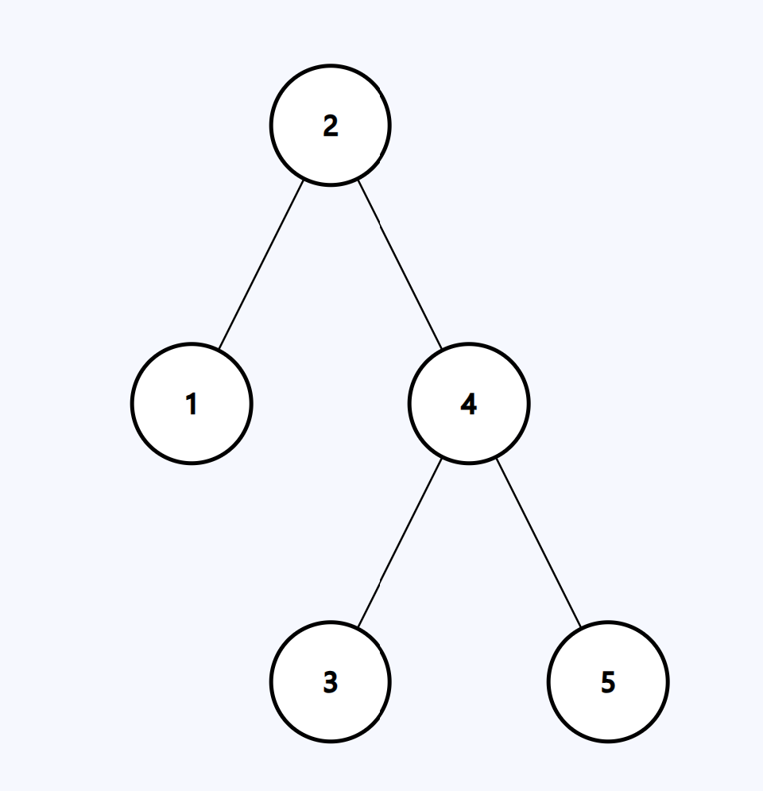

This report will examine the performance characteristics of AVL trees and compare them to that of a BST using both random data and sorted data. We'll discuss the time and space complexity of each algorithm, their implementations, and analyze the performance when inserting, finding, and removing data.

## Analysis of Algorithm/Datastructure

### Time Complexity Table

| Algorithm | Add/Insert | Remove | Search/Find | Sort<sup>1</sup>  |
| ------ | :------: | :------: | :------: | :------: |
| Binary Search Tree (Average) | $O(log n)$ | $O(log n)$ | $O(log n)$ | $O(n)$ |
| Binary Search Tree (Sorted)<sup>2</sup> | $O(n)$ | $O(n)$ | $O(n)$ | $O(n)$ |
| AVL Tree (Average) | $O(log n)$ | $O(log n)$ | $O(log n)$ | $O(n)$ |
| AVL Tree (Sorted) | $O(log n)$ | $O(log n)$ | $O(log n)$ | $O(n)$ |

<sup>1</sup> In-order traversal will print the data in sequential order</br>
<sup>2</sup> Sorted data is the worst-case performance of a BST

### Space Complexity

Both trees will be $O(n)$ as the tree is only as large as it needs to be. That being said, it does require more memory than something like an array, because we have to include additional data for storing the memory address from the parent to the child nodes.

### General Analysis of Algorithm/Data Structure

Because an AVL is an "upgraded" version of a BST, we'll first start with the BST.

At its core, a BST is a data structure that begins at a single node often called the "root." This root stores the data held within it, and points to up to 2 children, usually called the left and right child. A node without children is called a "leaf." Any node with children can be considered a "subtree" of the original tree, with that particular node being its root.

When inserting a new piece of data into a tree, the algorithm compares the data to the root node's data to determine its sorted order. If the new data comes before the root node data, the new data goes to the left child. If the left child doesn't exist yet, the algorithm creates a node there and stores that data. If there is already data there, it then compares itself to that node's data. This lends itself to a recursive relationship as it will continue traversing the tree until it arrives at a location with no node.

The BST maintains a sorted structure, because it will always traverse to the left child if it is less than the parent node, and will always traverse to the right if it is greater than the parent node. If the nodes are equal, in general we do not add them. But you could standardize it to go to one direction or the other if you wanted to have duplicate values. In our examples here, we do not allow duplicate entries.

Here is an animated version of the insertion process of a BST:</br>
</br>
[source](https://www.mathwarehouse.com/programming/gifs/binary-search-tree.php)

In this example, we happen to have somewhat random data being entered, and were lucky that the root node happened to be the middle value of the data set. On the contrary, this animation shows various possible structures of a BST as the data becomes more and more sorted.
*Note: Each mutation of this structure is the "end result" of the BST due to a change in the order in which the data was inserted, not the tree transforming as a result of different data.*

</br>
[source](https://www.mathwarehouse.com/programming/gifs/binary-search-tree.php)

As the data is more sorted, the "tree" more closely resembles a linked list. Enter the AVL. The AVL tree adds an extra component to its insertion and removal algorithms that checks for the "balance" of a tree, and reorganizes the structure when an imbalance occurs. An example looks like this:</br></br>
[source](https://upload.wikimedia.org/wikipedia/commons/f/fd/AVL_Tree_Example.gif)

In order to calculate the balance, the nodes hold an additional field that measures it's "height." The height is the greatest distance from itself to its furthest leaf node within the subtree. An empty node (such as null) has height 0, and a single node is height 1.

Our "linked list BST" has a height of 5:
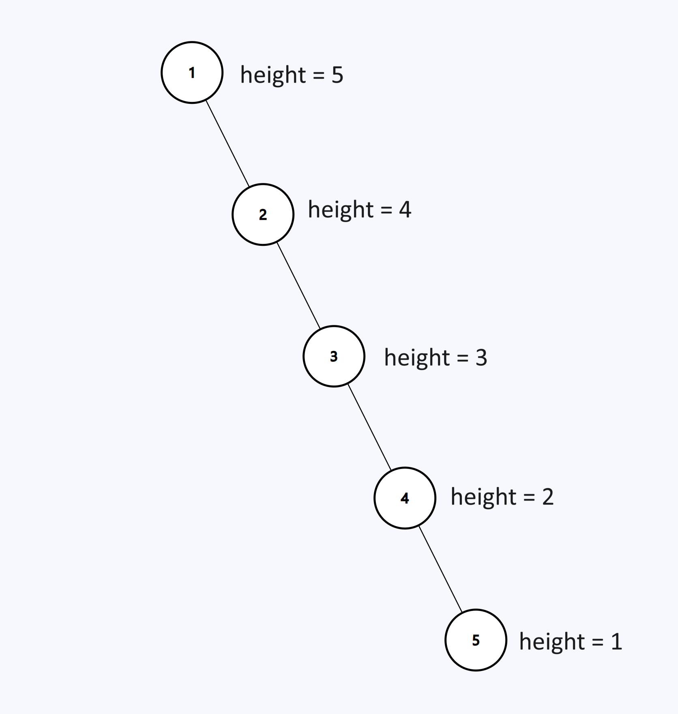

Whereas our balanced AVL tree has a height of 3.
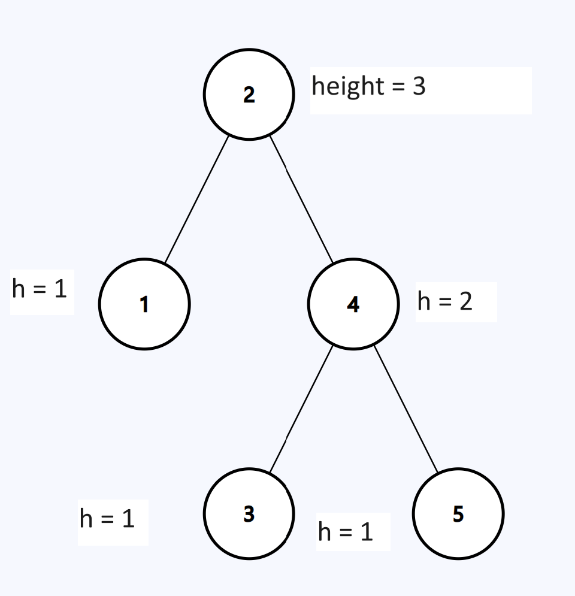

The balance of a node is determined by the difference in heights of its left child and right child. It does not matter which you choose, but it must be consistent. In our implmentation, we decided that balance = left_height - right_height. As a result, positive numbers indicate a left-heavy tree, and negative numbers indicate this is a right heavy tree. *Note: This is inverse of the animated gif from above, which determines balance by right - left*

The AVL will automatically rebalance when the absolute value any node's balance factor exceeds 1. i.e. it is -2 or 2. It does this by what's called a "rotation", where it shifts the root and children nodes around in the tree to re-establish balance. It does so by changing the pointers so one child becomes the root, the original root becomes a child, and the grandchild becomes the other child.

To demonstration, we will step through the process of inserting the BST and how the AVL will rebalance it.

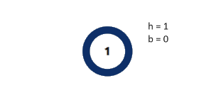</br>
A tree with 1 node has height of 1 and balance of 0.

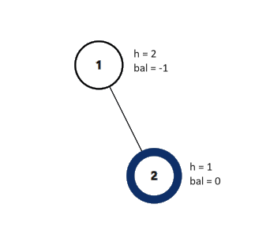</br>
Inserting 2, node 1 has a height of 2 and balance of -1. Still within acceptable limits. Node 2 has a height of 1 and balance of 0.

After inserting 3, we reach our first imbalance. Node 1 has a balance of -2, so we must rotate to the left.
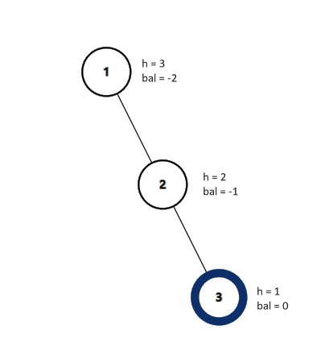 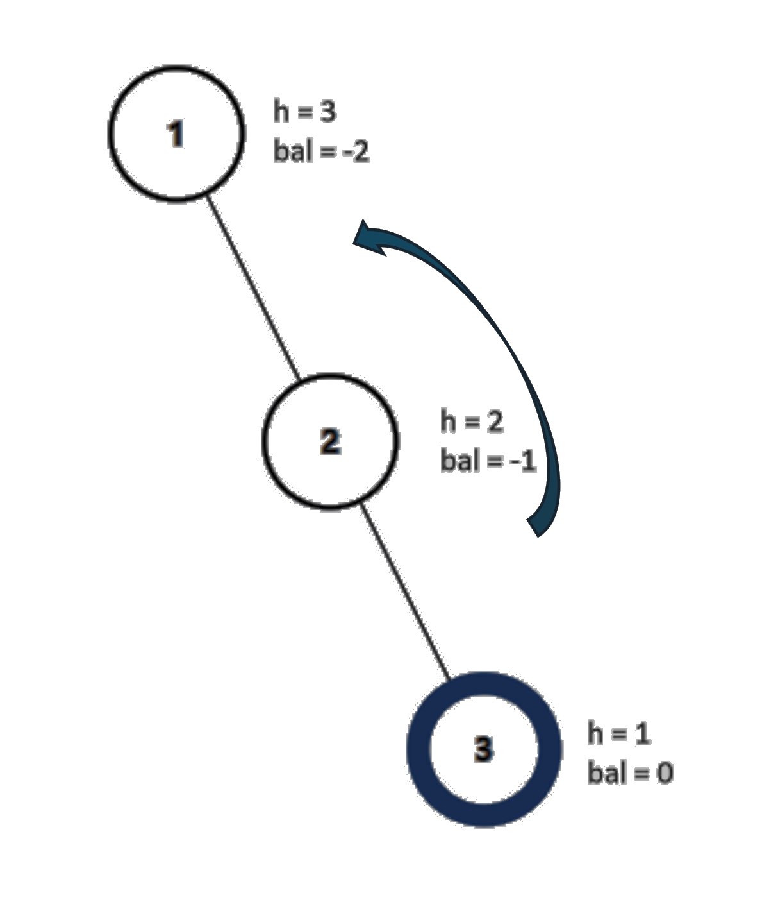 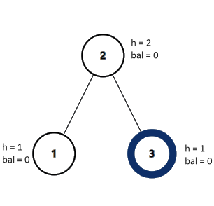</br>
2 becomes the root, 1 becomes the left child, and 3 becomes the right child.

Next, in order to prove another case in which the imbalance is "zig-zagged", we'll show a scenario that requires a "double rotation." First, we'll insert 5.</br>
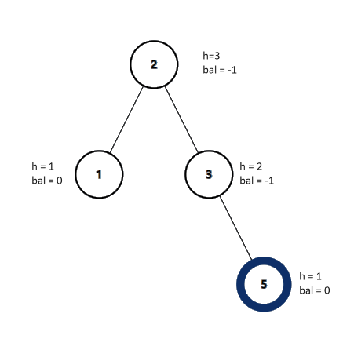

Finally, we insert 4. This creates a new imbalance. Notice that both the main root node, and the right child have imbalances. The shape, however, is zig-zagging. This means we must do a double rotation. We first rotate the bottom two nodes to the right so that we create a right side imbalance, and then we rotate to the left. The result is a rebalanced tree.</br>
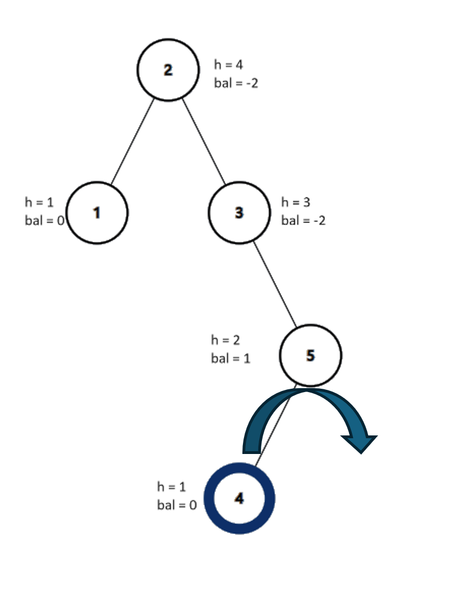
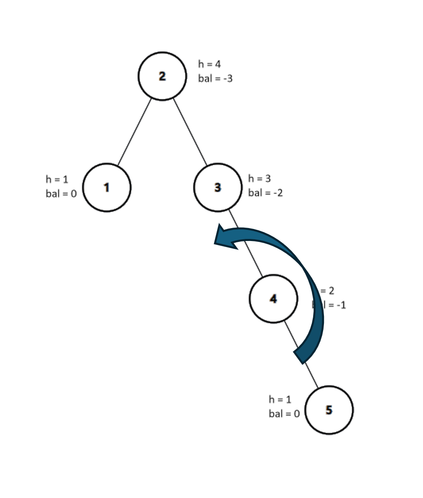
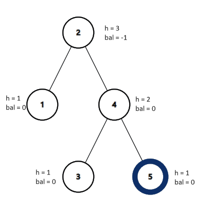

## Empirical Analysis

We conducted two sets of tests with 2 different datasets. One was a somewhat random list of just shy of 1 million movie titles, all of which were unique. The raw results can be found at [results_unique.csv](../results_unique.csv). 

### Sample of the head and tail of random data

| N     | AVL Add  | BST Add  | AVL Add Rotations | AVL Add Height | BST Add Height | AVL Search | BST Search | AVL Save | BST Save | AVL Remove | BST Remove | AVL Remove Rotations |
|-------|----------|----------|-------------------|----------------|----------------|------------|------------|----------|----------|------------|------------|----------------------|
| 5000  | 0.003094 | 0.002257 | 3850              | 15             | 53             | 0.001895   | 0.001876   | 0.000613 | 0.000938 | 0.003529   | 0.002429   | 1174                 |
| 10000 | 0.006297 | 0.00738  | 7563              | 16             | 55             | 0.005811   | 0.005077   | 0.001603 | 0.00156  | 0.007344   | 0.005829   | 2126                 |
| 15000 | 0.009821 | 0.00773  | 11259             | 17             | 55             | 0.007955   | 0.008638   | 0.003018 | 0.003372 | 0.011537   | 0.011558   | 3313                 |
| 925000 | 2.025506 | 2.457079 | 748194 | 24 | 229 | 1.82821  | 2.216585 | 0.229529 | 0.245577 | 2.809235 | 2.824017 | 250870 |
| 925174 | 1.922588 | 2.530133 | 748339 | 24 | 229 | 1.822546 | 2.490948 | 0.214757 | 0.225747 | 2.780442 | 3.189328 | 252082 |

- The second test was approximately 100k titles, but in a sorted list, simulating the worst case scenario for a BST. These results can be found at [results_sorted.csv](../results_sorted.csv).

### Sample of the results from the sorted data

| N     | AVL Add  | BST Add  | AVL Add Rotations | AVL Add Height | BST Add Height | AVL Search | BST Search | AVL Save | BST Save | AVL Remove | BST Remove | AVL Remove Rotations |
|-------|----------|----------|-------------------|----------------|----------------|------------|------------|----------|----------|------------|------------|----------------------|
| 5000  | 0.003327 | 0.209517 | 4987              | 13             | 5000           | 0.00148    | 0.178626   | 0.000638 | 0.000733 | 0.003693   | 0.240651   | 515                  |
| 10000 | 0.006407 | 0.935669 | 9986              | 14             | 10000          | 0.004951   | 0.799874   | 0.001365 | 0.001322 | 0.012301   | 1.016156   | 1045                 |
| 15000 | 0.006359 | 1.964225 | 14986             | 14             | 15000          | 0.006631   | 1.780919   | 0.001902 | 0.001811 | 0.021113   | 2.000365   | 1689                 |
| 95000 | 0.048942 | 79.840039 | 94983 | 17 | 95000 | 0.058966 | 59.669995 | 0.015821 | 0.015745 | 0.112603 | 70.531205 | 13978 |
| 99997 | 0.052469 | 79.608502 | 99980 | 17 | 99997 | 0.060234 | 58.798485 | 0.012974 | 0.014084 | 0.094458 | 73.430101 | 14844 |

### Analysis

#### Comparing the Adding Speed with a Random Set of Data


#### Findings

When using random or almost random data, it took similar time to build each tree. Overall, by the end of the program and N approached 1 million, we were the AVL perform about .2-.5 seconds faster than the BST. The AVL didn't start to consistently outperform the BST until around N=55,000, which could be attributed to the extra overhead that it took to rotate the tree after insertion. 

The BST quickly grew in height to almost 55 after just 5,000 movies, but stayed around that number up until 90,000, indicating the those 80,000 movies weren't any further down the chain. The AVL tree reached a height of 15 in the first 5,000 movies, but only grew slowly, reaching a maximum height of 24 compared to BST's 229. This shows that traveling an extra 30 levels in the beginning wasn't such a problem, but eventually the height became a hinderance. 


Search and save showed similar performance in both algorithms. This is expected as an AVL tree searches the same way a BST searches. The AVL tends to have better performance as N gets large due to its balanced nature keeping the height in check. This confirms our initial hypothesis that AVL tree can maintain a time complexity of $O(log n)$ while the BST tree was drifting towards $O(n)$. However, we wanted to see what the worst case looked like.


Sorted data was the AVL tree's time to shine. Please take note that the blue AVL line is not the horizontal axis, but the actual data and time. Up to 100,000 titles were added, and the AVL tree remained magnitudes faster than the BST. The BST, due to becoming a linked list when inserting sorted data, displayed $O(n)$ behavior as the height actually equaled n.

## Application

The algorithm is a branch of the BST family, as there are other version of balancing BSTs. However, any of these are suitable for applications that manipulate large swaths of sorted data, for example, employee databases. It is also used for programs requiring fast lookup speeds through sorted data, such as autofill programs looking up your input as a prefix.[^3]

Any program that would benefit from a BST for lookup should have a balancing feature. AVL provides an efficient means of balancing the tree with minimal overhead.

## Implementation

We implemented the AVL in C, because we already had a structure for the program with a previous homework to include the framework for our speed tests. No external libraries were required for this implementation.

The primary starting point was with our Binary Search Tree, so we had implemented that prior to making any adjustments for the balancing feature. As such, we'll focus more on the unique aspects of the AVL tree that separate it from the BST.

The first aspect of the node we included was determining the height.
We have three functions, two public and one helper that gives the user access to the overall height, and then a private helper function that determines the height at each specific node during the actual implementation. During node construction, we automatically set a non-empty leaf node to be of height 1. The get height functions simply check if the calling node is null, and if it is not null, it gets the height from its instance variables.

```c
int __avl__getHeight(AVLNode *root)
{
    if (root == NULL)
    {
        return 0;
    }
    return root->height;
}

int getHeight(AVL *avl)
{
    // If the tree is empty, height is 0;
    if (avl->root == NULL)
    {
        return 0;
    }
    // Otherwise, get the height of the root node.
    AVLNode *curr = avl->root;
    return __avl__getHeight(curr);
}
```

Insertion is our first means of checking, then adjusting height. When adding a node, it will determine the correct location via BST insertion methodology, but once it has been added, we call the for a rebalancing via rebalance_tree(). Due to the recursive nature of the insertion, this rebalance gets called from the inserted leaf's parent node all the way up until back at the root.

```c
AVLNode *__avl__add(AVLNode *curr, Movie *movie, int *size, int *rotations)
{
    // If curr is NULL, make a new node
    if (curr == NULL)
    {
        // printf("Creating new node in null position\n");
        // Increase size of avl
        (*size)++;
        return __avl__new_node(movie);
    }
    // Compare the movie to the root, determine if its smaller or larger
    int cmp = compare_movies(movie, curr->movie);

    // If its smaller, check if curr's left child is NULL -
    // If it's the same movie, return the same node.
    if (cmp == 0)
    {
        // printf("Movie matched, returning current node\n");
        return curr;
    }
    else if (cmp < 0)
    {
        // If less than the root, insert on the left side
        // printf("Movie is before, so adding left side\n");
        curr->left = __avl__add(curr->left, movie, size, rotations);
        // printf("Attempting to rebalance the left side\n");
    }
    else if (cmp > 0) // else check if it goes to the right side
    {
        // printf("Movie is after, so adding right side\n");
        curr->right = __avl__add(curr->right, movie, size, rotations);
        // printf("Attempting to rebalance the right side\n");
    }
    curr = rebalance_tree(curr, rotations);
    return curr;
}

AVLNode *rebalance_tree(AVLNode *root, int *rotations)
{
    // Determine if rebalance is required. Positive means heavier on the left, negative means heavier on the right.
    // printf("Getting balance\n");
    int balance = getBalance(root);
    // If unbalanced to the left
    if (balance > 1)
    {
        // Determine if we need to do a single or double rotation. If left is higher than the right, then single rotation.
        // From the left child, if ITS  left is higher than the right, rotate to the right
        // printf("Balance is >1\n");
        int subTreeBalance = getBalance(root->left);
        if (subTreeBalance > 0)
        {
            root = rotate_right(root, rotations);
        }
        else
        {
            // Otherwise, the tree is zig-zagging, so we rotate left first to put it all on the left side
            // Then double rotate
            root->left = rotate_left(root->left, rotations);
            root = rotate_right(root, rotations);
        }
    }
    else if (balance < -1)
    {
        // printf("Balance is -1\n");
        // Determine if we need to do a single or double rotation. If right is higher than the left, then single rotation.
        // From the right child, if ITS right is higher than the left, rotate to the left
        int subTreeBalance = getBalance(root->right);
        // printf("subtree balance is %d\n", subTreeBalance);
        if (subTreeBalance < 0)
        {
            // printf("trying to rotate left\n");
            root = rotate_left(root, rotations);
        }
        else
        {
            // Otherwise, the tree is zig-zagging, so we rotate left first to put it all on the left side
            // Then double rotate
            root->right = rotate_right(root->right, rotations);
            root = rotate_left(root, rotations);
        }
    }
    else
    {
        // else no rotation required, check/adjust height
        adjustHeight(root);
    }
    return root;
}
```

If the balance does not exceed -1 or 1, then we simply adjust the height as it works its way back up to the root. The height adjustment also benefits from the recursive nature of the original call, as it simply adds 1 to the greater of its two children's heights.  

```c

void adjustHeight(AVLNode *root)
{
    // Null check - early return
    if (root == NULL)
    {
        return;
    }
    // Get the heights of the two children nodes
    int height_left = __avl__getHeight(root->left);
    int height_right = __avl__getHeight(root->right);
    // Set the root height to 1 + the max of the children.
    if (height_left > height_right)
    {
        root->height = height_left + 1;
        return;
    }
    root->height = height_right + 1;
}
```

If the balance did exceed the limit, then we perform a rotation. A rotation can be either to the left or the right, determined by which side is "heavy." To rotate left, it does so by temporary holding the right child as the new root node. This node is already pointing to *its* right child. The old root (about to be the left child), takes the right->left grandchild as its right child, and then we set the new root's left child as the old root node. Finally, we re-adjust the heights of the root and new root.

```c
AVLNode *rotate_left(AVLNode *root, int *rotations)
{
    // Temp hold right child (new root)
    AVLNode *newRoot = root->right;
    // Set the original root->right->left to be the future root->left->right
    root->right = root->right->left;
    // Make the new root's left child the original root.
    newRoot->left = root;
    // Correct the heights of the original root and temp
    adjustHeight(root);
    adjustHeight(newRoot);
    (*rotations)++;
    // Add to rotation counter
    // Change the root pointer to point to the temp.
    return newRoot;
}
```

Once we figured out insertion, the next challenge was rebalancing after a removal.
The removal really involves a few steps - we first have to find the correct node to delete, then determine if we have any children that can directly replace it. In this case, we check for a left child, and if not we assume there is a right child. We check this for null, and if it's null, then we are deleting a leaf. Here, we can copy the contents of the current node into the temporary one, set the current to null and free the temporary one. In the event there are two children, we decide to take the next in-order successor node as the replacement. So we go to the right child, then follow the left child all the way down until we reach a leaf. We copy this data up into the original root, then call for the removal of that leaf node (at the old position). Finally, we call for a rebalancing of the current node, which will go back up, adjust the heights, and check for necessary rotations.

```c
AVLNode *__avl__remove(AVLNode *curr, Movie *movie, int *size, int *rotations)
{

    // If the provided node is null, abort and early return.
    if (curr == NULL)
    {
        // printf("Current node is null\n");
        return NULL;
    }
    // If the node is found
    if (compare_movies(movie, curr->movie) == 0)
    {
        // printf("Match was found\n");
        // If there is one or zero children
        if (curr->left == NULL || curr->right == NULL)
        {
            // Check for left child, otherwise assume there's a right child
            AVLNode *tmp;
            if (curr->left != NULL)
            {
                tmp = curr->left;
            }
            else
            {
                tmp = curr->right;
            }
            // Check if tmp is null, signifying zero children
            if (tmp == NULL)
            {
                // printf("There were no children\n");
                // Set tmp to be the current node and nullify current
                tmp = curr;
                curr = NULL;
                free(curr);
            }
            else
            {
                // Otherwise, set curr to be the tmp child
                *curr = *tmp;
            }
            // Free the tmp (old curr)
            // printf("Freeing the temp\n");
            free(tmp);
        }
        else // We have 2 children.
        {
            // printf("Node has two children\n");
            // Otherwise, set the minimum in order starting from the right subtree
            AVLNode *min = curr->right;
            // Travel down the left side of the right subtree until getting to a leaf (minimum inorder)
            while (min->left != NULL)
            {
                min = min->left;
            }
            // printf("Replacing the deleted node\n");
            // Move the data from this leaf into the current node
            curr->movie = min->movie;
            // Go down to the leaf with the original movie and remove it.
            curr->right = __avl__remove(curr->right, min->movie, size, rotations);
        }
    }
    // If the movie is less than current, go down the left subtree
    else if (compare_movies(movie, curr->movie) < 0)
    {
        // printf("Not a match, go left side\n");
        curr->left = __avl__remove(curr->left, movie, size, rotations);
    }
    // Else go down the right subtree to continue the search.
    else
    {
        // printf("Not a match, go right side\n");
        curr->right = __avl__remove(curr->right, movie, size, rotations);
    }

    // Otherwise, rebalance the tree
    curr = rebalance_tree(curr, rotations);
    // If the current node is still null, it was the only node in the tree, so return.
    if (curr == NULL)
    {
        return NULL;
    }
    (*size)--;
    // Return the now balanced subtree
    return curr;
}
```

For data gathering purposes, we added a rotation count to the avl tree struct, and height to the BST. For each function, we sent in a pointer to this value, and the rotation function is the one that actually incremented the rotation counter if it performed a rotation.

The most challenging portion was converting the BST to an AVL initially, as the BST was written with all void returns. I tried for a couple days to also use a void return on the AVL as a means to keep it identical, but I noticed that the root node wouldn't be aware of when a rotation had occurred, so it would often point to a NULL node. 

## Summary

Overall, the AVL performed as we expected it to - it gave us consistent BST performance when we dealt with non-ideal data sets. It was faster than I expected to perform the rotations, and I'm still amazed that the algorithm seems somewhat simple for calculating an imbalance and correcting it.

[^1]: Wikipedia. Retrieved from [https://en.wikipedia.org/wiki/AVL_tree](https://en.wikipedia.org/wiki/AVL_tree).

[^2]: Erik Demaine, Jason Ku, and Justin Solomon. Lecture 7: Binary Trees II: AVL Last Time and Today’s Goal Sequence Data Structure. Retrieved April 12, 2024 from [https://ocw.mit.edu/courses/6-006-introduction-to-algorithms-spring-2020/a2c80596cf4a2b5fbc854afdd2f23dcb_MIT6_006S20_lec7.pdf](https://ocw.mit.edu/courses/6-006-introduction-to-algorithms-spring-2020/a2c80596cf4a2b5fbc854afdd2f23dcb_MIT6_006S20_lec7.pdf).

[^3]: Practical Applications of AVL Trees | CodingDrills. Codingdrills.com. Retrieved April 13, 2024 from https://www.codingdrills.com/tutorial/tree-data-structure/avl-applications

## Bibliography

[1] Mahdi Amani. 2018. Gap terminology and related combinatorial properties for AVL trees and Fibonacci-isomorphic trees. AKCE international journal of graphs and combinatorics/AKCE International Journal of Graphs and Combinatorics 15, 1 (April 2018), 14–21. DOI:https://doi.org/10.1016/j.akcej.2018.01.019

[2]: 2021. AVL tree. Wikipedia. Retrieved from [https://en.wikipedia.org/wiki/AVL_tree](https://en.wikipedia.org/wiki/AVL_tree).

[3]: Erik Demaine, Jason Ku, and Justin Solomon. Lecture 7: Binary Trees II: AVL Last Time and Today’s Goal Sequence Data Structure. Retrieved April 12, 2024 from [https://ocw.mit.edu/courses/6-006-introduction-to-algorithms-spring-2020/a2c80596cf4a2b5fbc854afdd2f23dcb_MIT6_006S20_lec7.pdf](https://ocw.mit.edu/courses/6-006-introduction-to-algorithms-spring-2020/a2c80596cf4a2b5fbc854afdd2f23dcb_MIT6_006S20_lec7.pdf).

[4]: 2024. Practical Applications of AVL Trees | CodingDrills. Codingdrills.com. Retrieved April 13, 2024 from https://www.codingdrills.com/tutorial/tree-data-structure/avl-applications

[5]: Frank Pfenning. Lecture 16 AVL Trees 15-122: Principles of Imperative Computation (Fall 2023) Frank Pfenning. Retrieved from https://www.cs.cmu.edu/~15122-archive/f23/handouts/lectures/16-avl.pdf
